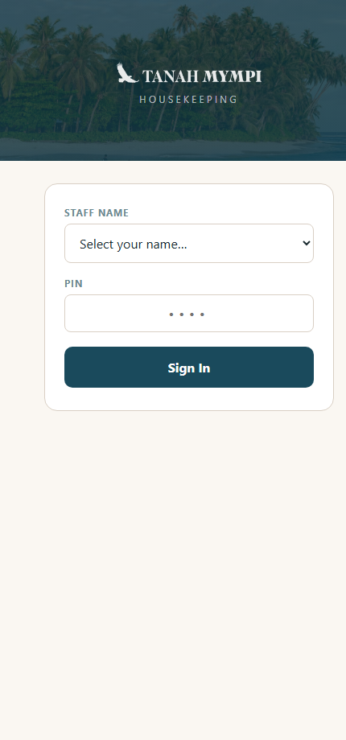
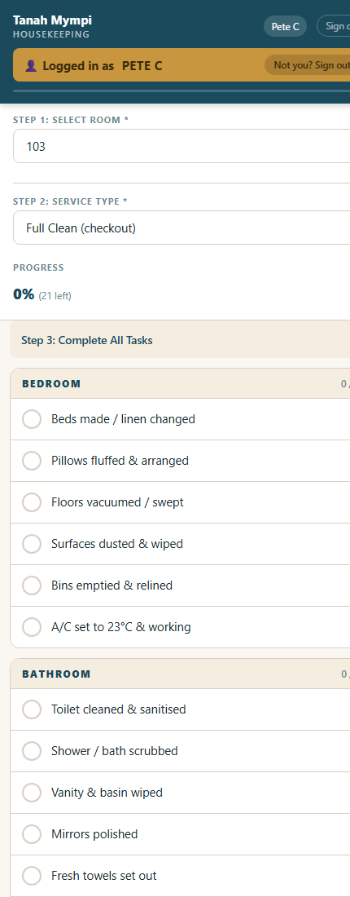
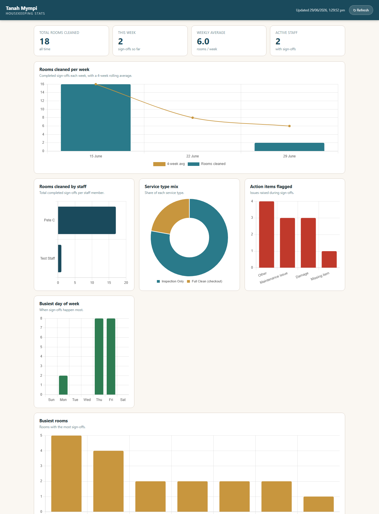
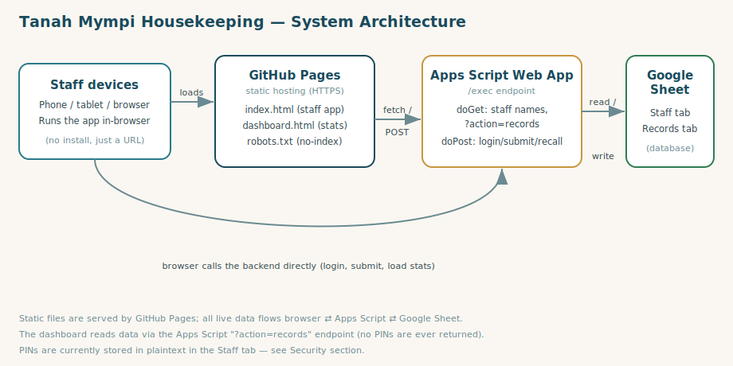

# Tanah Mympi Housekeeping — Support & As-Built Guide

A standalone reference for anyone who needs to **understand, review, operate, or fix** the Tanah
Mympi housekeeping app. If you are new to this system, read the Overview and Architecture sections
first; if something is broken, jump to Troubleshooting.

> **Status:** Live in production. **Last updated:** 2026-06-29.
> This document is the source (`HOUSEKEEPING_APP_SUPPORT.md`); the matching
> `HOUSEKEEPING_APP_SUPPORT.pdf` is the shareable copy and is regenerated whenever this file changes.

---

## 1. Quick reference

| Thing | Value |
|---|---|
| **Staff app (live)** | https://pjcoxy.github.io/tanah-mympi-staff/ |
| **Stats dashboard (live)** | https://pjcoxy.github.io/tanah-mympi-staff/dashboard.html |
| **Source code (GitHub)** | https://github.com/Pjcoxy/tanah-mympi-staff (public) |
| **Hosting** | GitHub Pages — branch `main`, root folder |
| **Backend** | Google Apps Script web app (`/exec` endpoint) |
| **Database** | Google Sheet (ID `19lrq6Sp7wY0q74mtZd0VDgLwj4QGu1Vf-LUEEMDzbPY`) |
| **Apps Script project** | https://script.google.com/d/1F7ZbhlHNl_BI9W0_mOkN9hWfAHSKHNOO5w9Ul4LsvfZRsAs_wgpGWpAy/edit |

---

## 2. Overview

The app lets housekeeping staff sign off completed room cleans on their phone or tablet. They log
in with a name + PIN, step through a checklist tailored to the type of service, flag any issues
(maintenance, damage, missing items), and submit. Every submission and login is recorded in a
Google Sheet, and a separate dashboard turns that data into charts for management.

**Design goals:** zero install (just a URL), works on any phone, cheap to run (free hosting +
Google Sheets), and simple enough to maintain without a developer on staff.

### Key features
- PIN-based staff login (shared-device friendly — a prominent "Logged in as" banner shows who is active)
- Progressive, guided checklist that adapts to the service type
- Action-item flags for follow-up (maintenance / damage / missing item / other)
- Requires an internet connection to submit; warns when offline
- All activity logged to Google Sheets (submissions + login/logout audit)
- Stats dashboard with weekly trends and breakdowns

---

## 3. Visual tour

> Screenshots live in `docs/screenshots/`. Regenerate them from the live site with
> `python docs/capture_screenshots.py` (headless Edge), then rebuild the PDFs with
> `python docs/build_docs.py`. Re-do both after any UI change.

**Login screen**



**Room sign-off form (note the gold "Logged in as" banner pinned at the top)**



**Stats dashboard**



---

## 4. Architecture



The system has three moving parts:

1. **Static front-end** (`index.html`, `dashboard.html`) served by **GitHub Pages**. These are plain
   HTML/CSS/JavaScript files — there is no server-side code in the hosting layer and no build step.
2. **Google Apps Script web app** — the back-end "API". The browser calls it directly over HTTPS.
   It validates logins, writes submissions, and returns data.
3. **Google Sheet** — the database. The Apps Script reads and writes two tabs (`Staff`, `Records`).

Data flow: the browser **loads** the app from GitHub Pages, then talks **directly** to the Apps
Script endpoint for all live data (it does not route through GitHub). The Apps Script is the only
thing that touches the Google Sheet, which keeps PINs off the public internet.

---

## 5. Components

### 5.1 Front-end — staff app (`index.html`)
A single self-contained file: inline CSS, inline vanilla JavaScript, no frameworks, no build.

- **Configuration** lives at the top of the `<script>` block:
  ```javascript
  const CONFIG = {
    SHEETS_URL: 'https://script.google.com/macros/s/.../exec', // backend endpoint
    TIMEOUT_MINS: 20,                                          // idle auto-logout
    ROOMS: ['101','102', /* ... */ ,'Suite B']                // room list shown in the form
  };
  ```
- **Login:** `doLogin()` POSTs `{action:'login', name, pin}` to the backend; on success it calls
  `showForm()`, which also sets the **"Logged in as NAME"** banner in the sticky header.
- **The checklist** is built from `<div class="item" data-section="..." data-services="...">` elements.
  `data-services` is a space-separated list (`full refresh turndown inspection`) that controls which
  service types show that item; `updateServiceItems()` shows/hides them when the service type changes.
  Sections are `bedroom`, `bathroom`, `minibar`, `final`.
- **Submit:** `submitForm()` requires an internet connection, builds the payload, and POSTs
  `{action:'submit', ...}`. A short "recall" window lets staff undo the last submission.
- **Idle timeout:** after `TIMEOUT_MINS` of inactivity the user is logged out.

### 5.2 Front-end — dashboard (`dashboard.html`)
A separate page that loads **Chart.js** (from a CDN) and pulls live data via
`GET {SHEETS_URL}?action=records` on each load. It filters to rows where `Type === 'SUBMISSION'`
and renders six charts:

| Chart | Shows |
|---|---|
| Rooms cleaned per week | Weekly count + a 4-week rolling average line |
| Rooms cleaned by staff | Total sign-offs per staff member |
| Service type mix | Share of Full Clean / Refresh / Turndown / Inspection |
| Action items flagged | Counts of maintenance / damage / missing / other |
| Busiest day of week | When sign-offs happen most |
| Busiest rooms | Rooms with the most sign-offs |

Key functions: `load()` (fetch), `render(records)` (aggregate + draw), `parseTs()` (timestamp parsing).

### 5.3 Back-end — Google Apps Script
A standalone Apps Script project (see Quick reference for the link). A version-controlled copy lives
in the repo at [`apps-script/Code.gs`](apps-script/Code.gs) — **this copy is not automatically synced
to the live project** (see Deployment).

- `doGet(e)` — routes on `?action`:
  - `?action=records` → returns every row of the `Records` tab as JSON objects (**never PINs**).
  - anything else (including the app's `?action=staff`) → returns the list of active staff names.
- `doPost(e)` — routes on `action` in the JSON body: `login`, `submit`, `recall`.
- Helpers: `handleLogin`, `handleSubmit`, `handleRecall`, `logEvent`, `json`.

### 5.4 Data model — the Google Sheet
Two tabs:

**`Staff`**
| Column | Meaning |
|---|---|
| A — Name | Staff display name (must match what they pick at login) |
| B — PIN | 4-digit PIN — **stored in plaintext** (see Security) |
| C — Active | `Yes` to allow login, anything else disables the account |

**`Records`** (one combined log of everything)
| Column | Meaning |
|---|---|
| Type | `SUBMISSION`, `LOGIN`, `LOGIN_FAIL`, or `RECALL` |
| Timestamp | Date/time (written as text like `18 June 2026, 4:54 PM`) |
| Staff Member | Who performed the action |
| Room | Room number (submissions only) |
| Service Type | e.g. `Full Clean (checkout)` (submissions only) |
| Action Required | Flagged issues, or `None` |
| Notes | Free-text notes / recall details |
| Device | Browser user-agent (trimmed) |

---

## 6. Hosting & deployment

- **Front-end deploy = `git push` to `main`.** GitHub Pages publishes the repo root within ~1 minute.
- The repo is **public** but kept **out of search engines** via `<meta name="robots" content="noindex">`
  in each HTML page and a root `robots.txt` (`Disallow: /`).
- **Back-end deploy is separate and manual.** After editing the Apps Script you must publish a new
  version of the *existing* deployment so the `/exec` URL stays the same:
  **Deploy → Manage deployments → ✏️ (edit) → Version: *New version* → Deploy.**
  ⚠️ Do **not** use "New deployment" — that creates a different `/exec` URL, which would then have to
  be updated in `CONFIG.SHEETS_URL` (in `index.html`) **and** in `dashboard.html`.
- The `gh` CLI is installed and authenticated (as `Pjcoxy`), so repo and Pages settings can be
  changed from the command line if needed.

---

## 7. Security considerations

This is a low-stakes operational tool, but reviewers should be aware of the following:

- **⚠️ PINs are stored in plaintext** in the `Staff` tab. Anyone with edit access to the Sheet can
  read every staff PIN. (An earlier version of this guide incorrectly said they were hashed — they
  are not.) Acceptable for a housekeeping sign-off; not suitable if PINs are reused elsewhere.
- **The data endpoint is open.** `?action=records` returns operational data (rooms, staff names,
  notes) to anyone who has the URL. It **never** returns PINs. This was a deliberate choice for
  simplicity; it can be locked behind an access key or staff login if required.
- **The repo is public.** Source, the Sheet ID, and the backend URL are visible. None of these grant
  access to the Sheet itself (which is not publicly shared), but be mindful before committing secrets.
- **No rate limiting / brute-force protection** on PIN login beyond the `LOGIN_FAIL` audit entries.

Recommended hardening if the system grows: hash PINs, gate the records endpoint, and move to Firebase
Auth or similar.

---

## 8. Operations — common tasks

**Add a staff member:** open the Sheet → `Staff` tab → add a row: Name, PIN, `Yes`.

**Disable a staff member:** set their `Active` column to anything other than `Yes` (e.g. `No`).

**Reset / change a PIN:** edit the PIN value in their `Staff` row. The change is immediate.

**Add or remove a room:** edit `CONFIG.ROOMS` in `index.html`, then commit & push.

**Add or change a checklist item:** in `index.html`, copy an existing
`<div class="item" data-section="..." data-services="...">`, set its section and the service types it
applies to, then commit & push.

**View the raw data:** open the Sheet → `Records` tab. **View charts:** open the dashboard URL.

---

## 9. Troubleshooting

| Symptom | Likely cause / fix |
|---|---|
| "Incorrect PIN" for a valid user | Check the `Staff` tab: exact Name match, correct PIN, `Active = Yes`. |
| Nothing submits / "connection error" | Device offline, or the Apps Script deployment is down. Test the `/exec` URL in a browser. |
| Dashboard shows "No records returned" | The `?action=records` endpoint isn't deployed. Re-publish a new version of the Apps Script. |
| Dashboard graphs empty after a change | Confirm the backend was redeployed as a **new version** (not a new deployment with a new URL). |
| Everything stopped working at once | The `/exec` URL changed (a new deployment was created). Update `SHEETS_URL` in `index.html` and `dashboard.html`. |
| App appears in Google search | Confirm `robots.txt` and the `noindex` meta tag are present; search removal can take time. |

---

## 10. Known limitations & future ideas
- Plaintext PINs and an open data endpoint (see Security).
- Timestamps are returned by the records endpoint as ISO/UTC strings; the dashboard converts to the
  viewer's local timezone, so day/week boundaries can shift for viewers far from the resort's timezone.
- No photo uploads (a `Photo Links` concept exists in the data but isn't wired up).
- Possible enhancements: a "Stats" link from the app header, fixed-timezone date handling, PIN hashing,
  and per-staff or per-room filtering on the dashboard.

---

## 11. Repository map
```
housekeeping/
├─ index.html                     # staff app
├─ dashboard.html                 # stats dashboard (Chart.js)
├─ robots.txt                     # search-engine block
├─ apps-script/Code.gs            # version-controlled copy of the backend
├─ docs/
│  ├─ architecture.svg            # diagram used in this guide
│  ├─ build_docs.py               # regenerates both guide PDFs
│  └─ screenshots/                # login.png, form.png, dashboard.png
├─ HOUSEKEEPING_APP_SUPPORT.md    # this document — technical guide (source)
├─ HOUSEKEEPING_APP_SUPPORT.pdf   # shareable PDF (generated from the .md)
├─ HOUSEKEEPING_USER_GUIDE.md     # staff how-to guide (source)
├─ HOUSEKEEPING_USER_GUIDE.pdf    # shareable PDF (generated from the .md)
└─ CLAUDE.md                      # project context for AI-assisted maintenance
```
